# Agent Client Protocol (ACP) Documentation

> Comprehensive protocol reference with PlantUML diagrams

## Overview

The **Agent Client Protocol (ACP)** standardizes communication between code editors/IDEs and AI coding agents. It uses JSON-RPC 2.0 over stdio for local agents, enabling any ACP-compatible agent to work with any ACP-compatible editor.

**Similar to LSP**: Just as the Language Server Protocol standardized language tool integration, ACP decouples agents from editors, allowing developers to choose best-of-breed tools without vendor lock-in.

### Key Resources

- **Official Docs**: https://agentclientprotocol.com/
- **GitHub**: https://github.com/agentclientprotocol/agent-client-protocol
- **JetBrains**: https://www.jetbrains.com/help/ai-assistant/acp.html
- **Zed**: https://zed.dev/acp

### Supported Editors

- JetBrains IDEs (Rider, IntelliJ, PyCharm, etc.)
- Zed
- Neovim (via plugins)
- Emacs, Obsidian, marimo (community plugins)

### SDK Libraries

- **Python**: `agent-client-protocol` on PyPI
- **Rust**: `agent-client-protocol` on crates.io
- **TypeScript**: `@agentclientprotocol/sdk` on npm
- **Kotlin**: `acp-kotlin`

---

## Protocol Fundamentals

### Transport

- **Local agents**: JSON-RPC 2.0 over stdio (newline-delimited, UTF-8)
- **Remote agents**: HTTP/WebSocket (in progress)
- Messages must not contain embedded newlines
- Agents may write logs to stderr

### Key Rules

1. **All file paths must be absolute**
2. **Line numbers are 1-based**
3. **Capabilities determine available features** - check before calling
4. **Every prompt gets exactly one PromptResponse** (even if cancelled)
5. **session/cancel is for in-progress prompts only**, not session termination
6. **Custom extensions use underscore prefix** (`_vendor/method`)

---

## PlantUML Diagrams

### 1. Architecture Overview

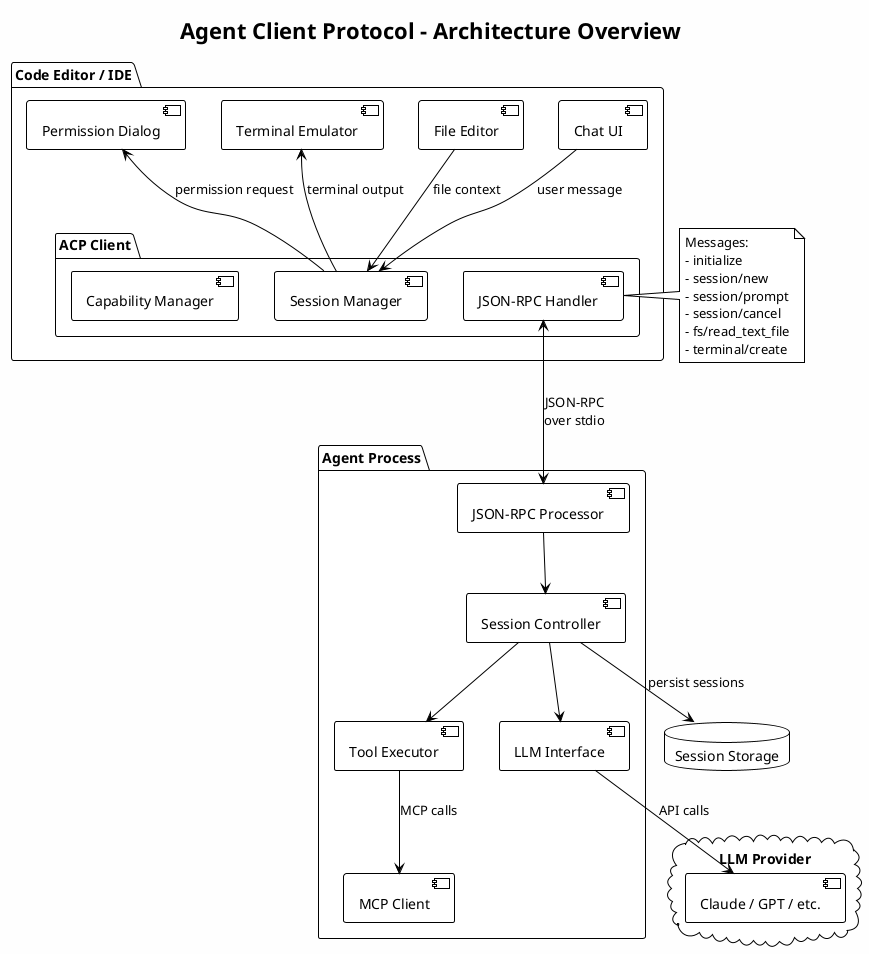

### 2. Protocol Message Flow

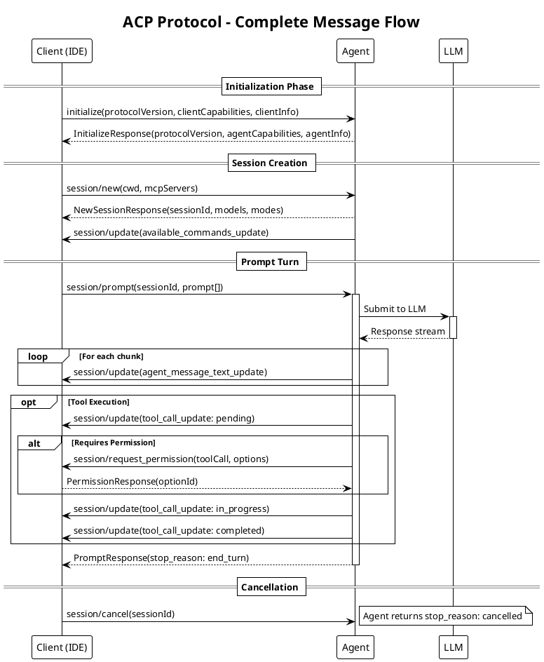

### 3. Initialization Sequence

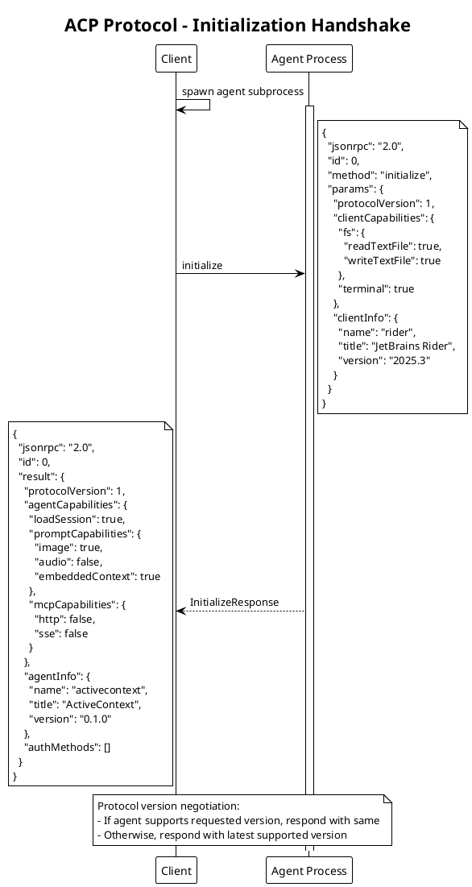

### 4. Session Lifecycle

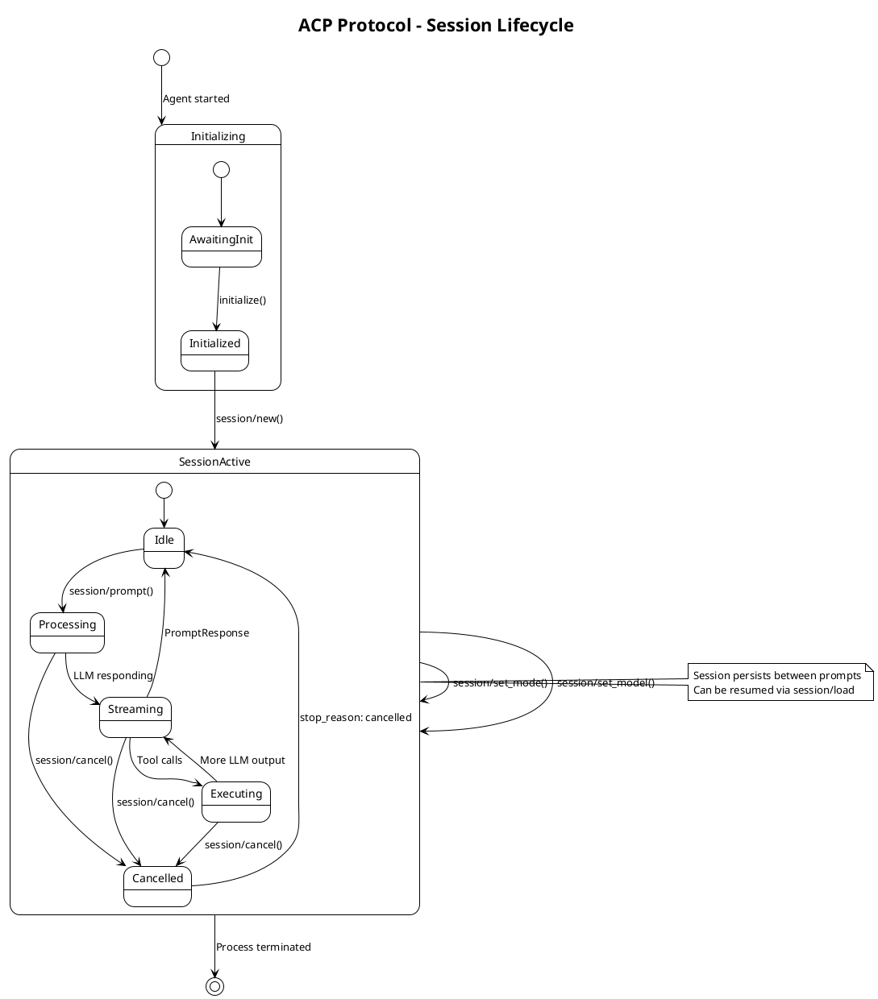

### 5. Prompt Turn Detail

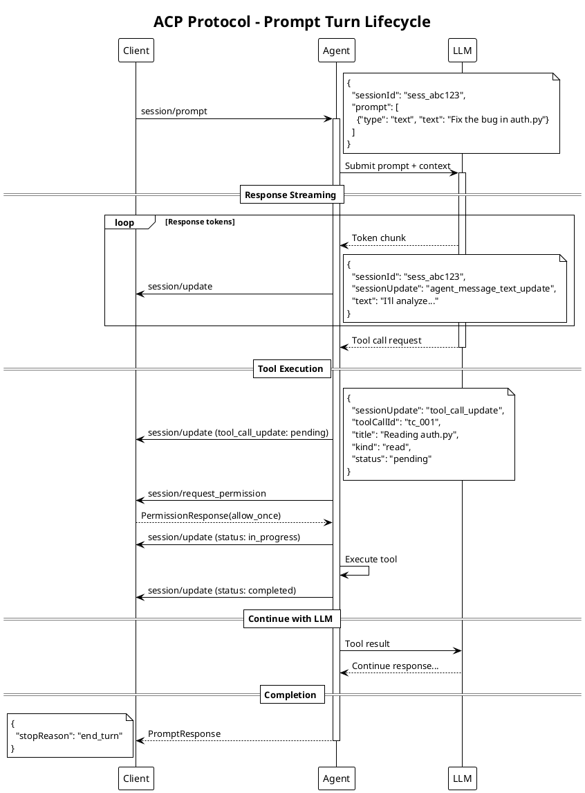

### 6. Permission Request Flow

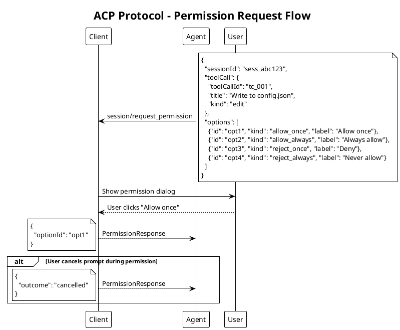

### 7. Terminal Operations

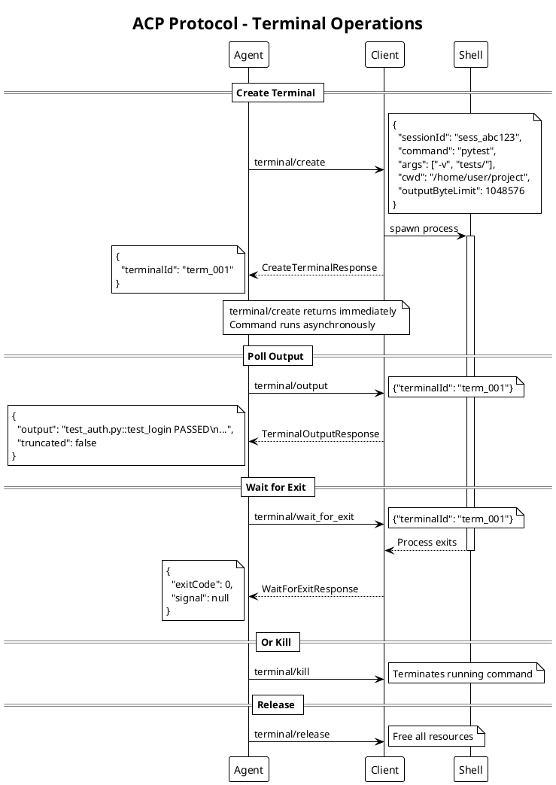

### 8. File System Operations

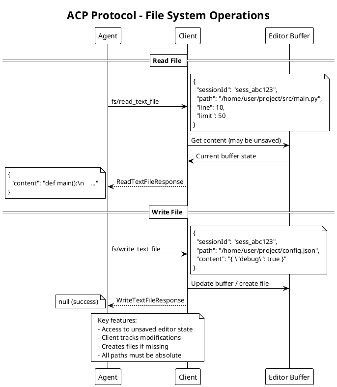

### 9. Session Modes

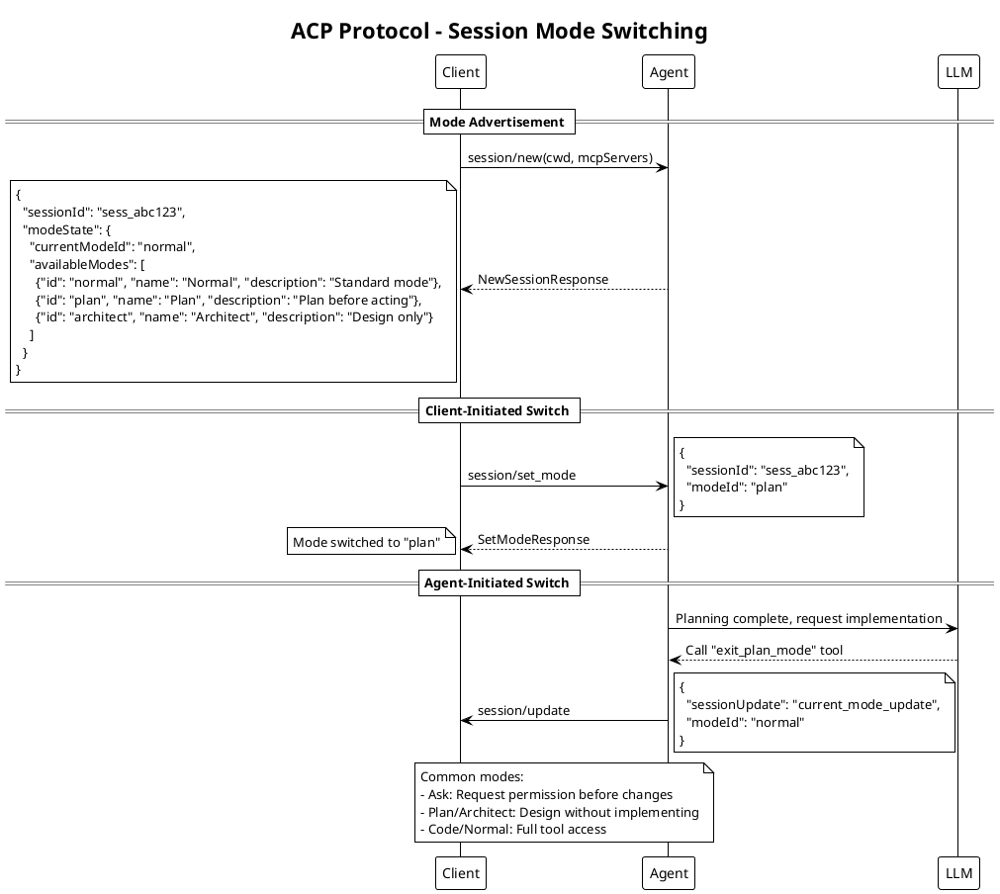

### 10. Tool Call Status Lifecycle

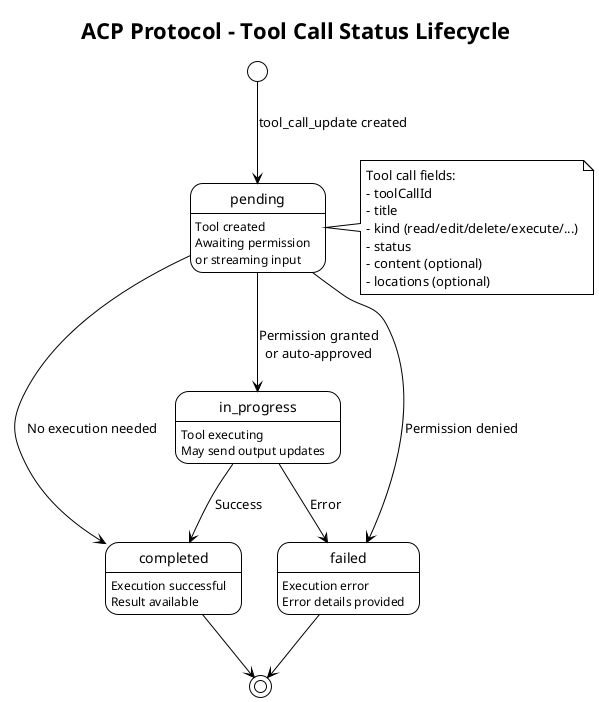

### 11. Content Block Types

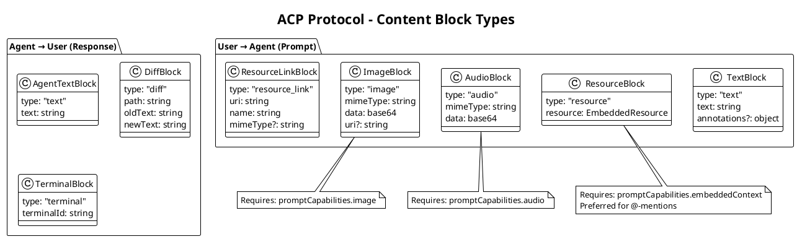

### 12. Plan Updates

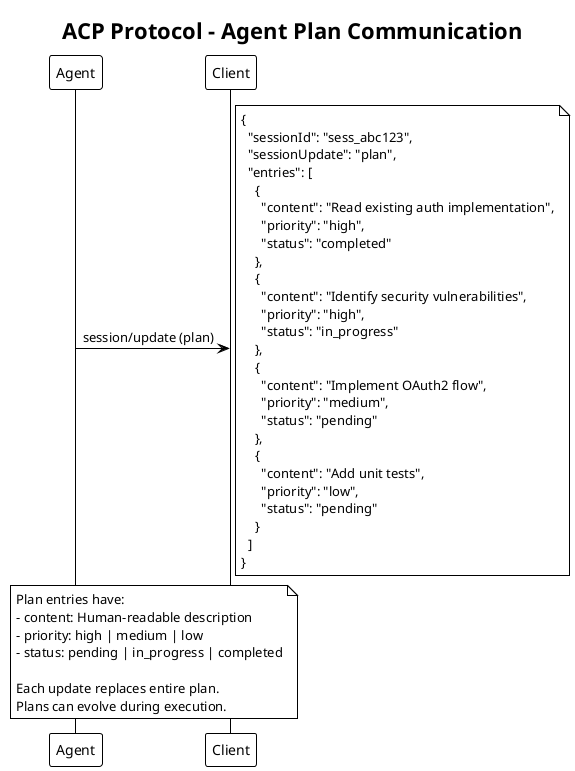

### 13. Complete Message Type Reference

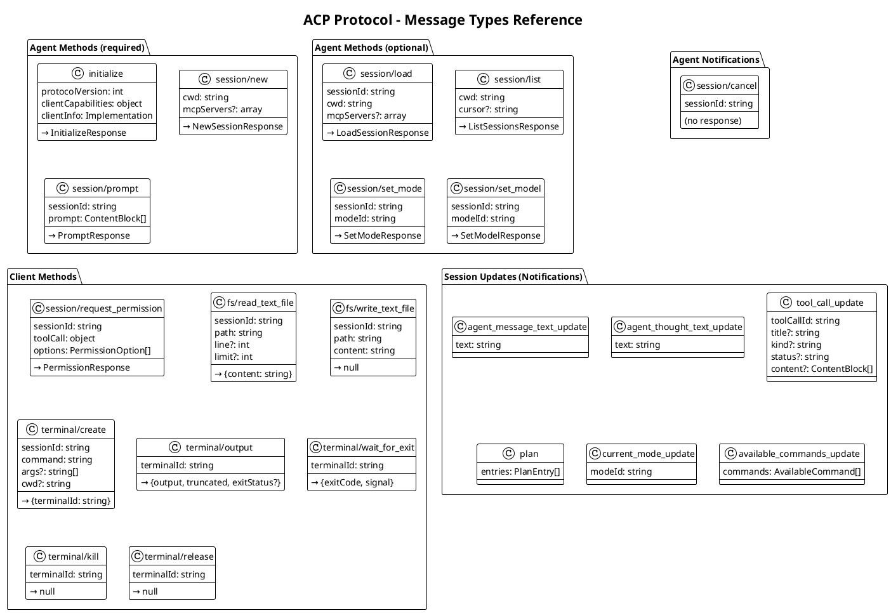

---

## Message Reference

### Agent Methods (Required)

| Method | Parameters | Response | Description |
|--------|------------|----------|-------------|
| `initialize` | `protocolVersion`, `clientCapabilities`, `clientInfo` | `InitializeResponse` | Handshake and capability exchange |
| `session/new` | `cwd`, `mcpServers?` | `NewSessionResponse` | Create new session |
| `session/prompt` | `sessionId`, `prompt[]` | `PromptResponse` | Send user message |

### Agent Methods (Optional)

| Method | Parameters | Response | Description |
|--------|------------|----------|-------------|
| `session/load` | `sessionId`, `cwd`, `mcpServers?` | `LoadSessionResponse` | Resume session |
| `session/list` | `cwd`, `cursor?` | `ListSessionsResponse` | List available sessions |
| `session/set_mode` | `sessionId`, `modeId` | `SetModeResponse` | Switch operating mode |
| `session/set_model` | `sessionId`, `modelId` | `SetModelResponse` | Switch LLM model |

### Agent Notifications

| Notification | Parameters | Description |
|--------------|------------|-------------|
| `session/cancel` | `sessionId` | Cancel in-progress prompt |

### Client Methods

| Method | Parameters | Response | Description |
|--------|------------|----------|-------------|
| `session/request_permission` | `sessionId`, `toolCall`, `options[]` | `PermissionResponse` | Request user permission |
| `fs/read_text_file` | `sessionId`, `path`, `line?`, `limit?` | `{content}` | Read file content |
| `fs/write_text_file` | `sessionId`, `path`, `content` | `null` | Write file content |
| `terminal/create` | `sessionId`, `command`, `args?`, `cwd?`, `outputByteLimit?` | `{terminalId}` | Start terminal |
| `terminal/output` | `terminalId` | `{output, truncated, exitStatus?}` | Get terminal output |
| `terminal/wait_for_exit` | `terminalId` | `{exitCode, signal}` | Wait for completion |
| `terminal/kill` | `terminalId` | `null` | Terminate command |
| `terminal/release` | `terminalId` | `null` | Release resources |

### Session Update Types

| Update Type | Fields | Description |
|-------------|--------|-------------|
| `agent_message_text_update` | `text` | Streamed response text |
| `agent_thought_text_update` | `text` | Intermediate thinking |
| `tool_call_update` | `toolCallId`, `title?`, `kind?`, `status?`, `content?` | Tool execution progress |
| `plan` | `entries[]` | Execution plan |
| `current_mode_update` | `modeId` | Mode changed |
| `available_commands_update` | `commands[]` | Slash commands |

---

## Stop Reasons

| Reason | Description |
|--------|-------------|
| `end_turn` | Model completed normally |
| `max_tokens` | Token limit reached |
| `max_turn_requests` | Too many LLM calls in turn |
| `refusal` | Agent refused to proceed |
| `cancelled` | Client cancelled prompt |

---

## Capabilities Reference

### Client Capabilities

```json
{
  "fs": {
    "readTextFile": true,
    "writeTextFile": true
  },
  "terminal": true
}
```

### Agent Capabilities

```json
{
  "loadSession": true,
  "promptCapabilities": {
    "image": true,
    "audio": false,
    "embeddedContext": true
  },
  "mcpCapabilities": {
    "http": false,
    "sse": false
  }
}
```

---

## Configuration Example

### JetBrains `~/.jetbrains/acp.json`

```json
{
  "agent_servers": {
    "activecontext": {
      "command": "python",
      "args": ["-m", "activecontext"],
      "env": {
        "ANTHROPIC_API_KEY": "sk-...",
        "AC_LOG": "C:\\Users\\You\\activecontext.log"
      },
      "use_idea_mcp": false,
      "use_custom_mcp": true
    }
  }
}
```

---

## Extensibility

### Custom Methods

Custom methods use underscore prefix: `_vendor.domain/feature/action`

### Meta Fields

All protocol types include `_meta` field for custom data:

```json
{
  "agentCapabilities": {
    "loadSession": true,
    "_meta": {
      "vendor": {
        "customFeature": true
      }
    }
  }
}
```

Reserved root keys: `traceparent`, `tracestate`, `baggage` (W3C trace context)

---

## Implementation Notes & Quirks

### JetBrains Session Resumption Workaround

**Issue**: JetBrains IDEs (Rider, IntelliJ, PyCharm, etc.) don't pass a session ID in `session/new` or call `session/load` for chat resumption. Each time you return to a chat, the IDE creates a new session instead of resuming.

**Workaround**: Read the chat UUID directly from the JetBrains task history filesystem:

```
%LOCALAPPDATA%\JetBrains\{IDE}\aia-task-history\*.events
```

The most recently modified `.events` file contains the current chat's UUID. This allows the agent to resume sessions even when the IDE doesn't explicitly request it.

**Activation**: Set `AC_CLIENT_JETBRAINS=1` in the `env` block of your `acp.json`:

```json
{
  "agent_servers": {
    "activecontext": {
      "command": "python",
      "args": ["-m", "activecontext"],
      "env": {
        "AC_CLIENT_JETBRAINS": "1"
      }
    }
  }
}
```

### Rider Shutdown Bug (Windows)

**Known Issue**: When deleting the *active* chat (the one you're currently viewing) in Rider, the IDE fails to close stdio pipes or terminate the agent subprocess.

**Symptom**: The agent process hangs indefinitely, waiting for input that never arrives.

**Workaround**: Delete chats from the chat list sidebar instead of while the chat is active. Deleting from the sidebar works correctly.

**Status**: Reported to JetBrains.

### Response Batching (Nagle-style)

To reduce overhead from per-token LLM streaming, the agent buffers `agent_message_text_update` notifications:

| Parameter | Default | Description |
|-----------|---------|-------------|
| `flush_threshold` | 100 chars | Flush immediately when buffer exceeds this |
| `flush_interval` | 50ms | Flush after this delay if threshold not reached |

Non-RESPONSE_CHUNK updates (e.g., tool calls) trigger an immediate flush to ensure proper ordering.

**Configuration** (in `config.yaml`):

```yaml
acp:
  batching:
    enabled: true
    flush_interval: 0.05
    flush_threshold: 100
```

### Update Modes

The agent supports two update delivery modes:

| Mode | Config | Behavior |
|------|--------|----------|
| **Async** | `out_of_band_update: true` | Send updates immediately as notifications. May arrive while `prompt()` is blocking on the client. |
| **Sync** | `out_of_band_update: false` | Queue updates during idle periods. Flush at the start of the next `prompt()`. |

Sync mode is safer for clients that don't handle out-of-band notifications well.

### Cancel Notification Handling

**Key invariant**: `session/cancel` is a notification (no response), but the agent must still return `PromptResponse(stop_reason="cancelled")` for any in-progress prompt.

**Implementation order is critical**:

1. Mark session as closed (prevents new updates from being sent)
2. Cancel the active prompt task with 1s timeout
3. Clean up chunk buffers (with timeout to avoid blocking)
4. Cancel the session in the session manager
5. Return `stop_reason: cancelled` in the PromptResponse

### Session Lifecycle Invariants

1. Every `session/prompt` MUST receive exactly one `PromptResponse`
2. `session/cancel` is ONLY for cancelling in-progress prompts, not session termination
3. There is NO ACP message for session/process termination
4. Shutdown happens via process termination (EOF on stdin or SIGTERM)
5. The agent must handle EOF on stdin gracefully

### Post-Session Setup Timing

After returning `NewSessionResponse`, the agent performs deferred setup:

1. Run startup scripts (emitting `tool_call_update` for each)
2. Advertise available slash commands via `available_commands_update`
3. Start the background agent loop for async processing

This is deferred using `asyncio.create_task()` so the session creation response returns quickly.

### Permission Request Patterns

| Permission Type | `kind` Value | Notes |
|-----------------|--------------|-------|
| File read | `read` | Absolute path required |
| File write | `edit` | Creates file if missing |
| Shell command | `execute` | Full command shown |
| Import | `execute` | Includes submodule option |
| Website GET | `read` | Domain shown |
| Website POST | `edit` | Domain shown |

All permission dialogs include at minimum:
- `allow_once` - Grant for this request only
- `allow_always` - Persist the grant
- `reject_once` / `deny` - Deny this request

### Debug Logging

Rider logs are located at:
- **High-level events**: `%LOCALAPPDATA%\JetBrains\{IDE}\log\acp\acp.log`
- **Raw JSON-RPC**: `%LOCALAPPDATA%\JetBrains\{IDE}\log\acp\acp-transport.log`

Enable extended logging via Rider's Registry key: `llm.agent.extended.logging`

---

## ActiveContext Implementation

This project implements ACP in:

- **Entry point**: `src/activecontext/__main__.py`
- **Agent implementation**: `src/activecontext/transport/acp/agent.py`
- **Session protocols**: `src/activecontext/session/protocols.py`
- **Terminal executor**: `src/activecontext/terminal/acp_executor.py`

### Additional Features

- Nagle-style response batching (50ms / 100 char threshold)
- JetBrains chat UUID detection for session resumption
- Configurable sync/async update modes
- Built-in slash commands: `/help`, `/clear`, `/context`, `/title`, `/dashboard`
