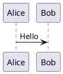

# ACP Protocol PlantUML Diagrams

This directory contains PlantUML diagrams documenting the Agent Client Protocol (ACP).

## Diagrams

| File | Description |
|------|-------------|
| `01-architecture.puml` | High-level architecture overview |
| `02-message-flow.puml` | Complete message flow sequence |
| `03-initialization.puml` | Initialization handshake with JSON examples |
| `04-session-lifecycle.puml` | Session state machine |
| `05-prompt-turn.puml` | Detailed prompt turn lifecycle |
| `06-permissions.puml` | Permission request flow |
| `07-terminal.puml` | Terminal operations |
| `08-filesystem.puml` | File system operations |
| `09-session-modes.puml` | Session mode switching |
| `10-tool-call-states.puml` | Tool call status lifecycle |
| `11-content-blocks.puml` | Content block types |
| `12-plan-updates.puml` | Agent plan communication |
| `13-message-types.puml` | Complete message type reference |
| `14-implementation-notes.puml` | Implementation quirks and workarounds |

## Rendering Diagrams

### Option 1: PlantUML CLI

```bash
# Install PlantUML (requires Java)
# macOS: brew install plantuml
# Ubuntu: apt install plantuml

# Render single file
plantuml 01-architecture.puml

# Render all diagrams to PNG
plantuml *.puml

# Render to SVG
plantuml -tsvg *.puml
```

### Option 2: PlantUML Server

```bash
# Using Docker
docker run -d -p 8080:8080 plantuml/plantuml-server:jetty

# Then open http://localhost:8080 and paste diagram code
```

### Option 3: VS Code Extension

1. Install "PlantUML" extension by jebbs
2. Open any `.puml` file
3. Press `Alt+D` to preview

### Option 4: Online Tools

- **PlantUML Server**: http://www.plantuml.com/plantuml/uml
- **Kroki**: https://kroki.io/

### Option 5: GitHub/GitLab Rendering

Some platforms render PlantUML in Markdown using code fences:

~~~markdown

~~~

## Batch Rendering Script

```bash
#!/bin/bash
# render-all.sh - Render all diagrams to PNG and SVG

for f in *.puml; do
    echo "Rendering $f..."
    plantuml -tpng "$f"
    plantuml -tsvg "$f"
done
echo "Done! Check for .png and .svg files."
```

## Diagram Types

- **Sequence diagrams** (02, 03, 05, 06, 07, 08, 09, 12): Show message flows between participants
- **State diagrams** (04, 10): Show state machines and transitions
- **Component diagrams** (01): Show system architecture
- **Class diagrams** (11, 13): Show data structures and types
- **Note diagrams** (14): Implementation notes and workarounds
